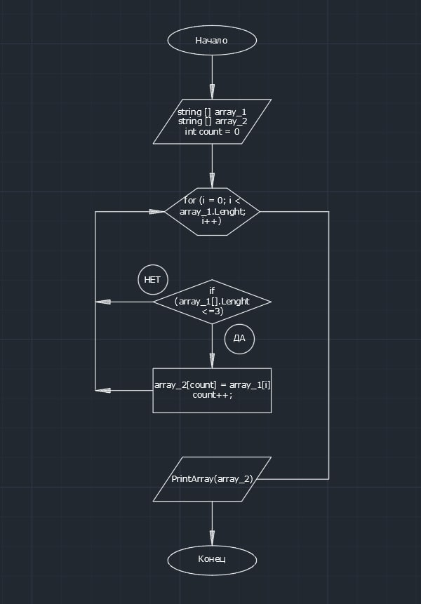

**Выбор специализации - итоговый проект**

Задача:
Написать программу, которая из имеющегося массива строк формирует массив из строк, длина которых меньше либо равна 3 символа. Первоначальный массив можно ввести с клавиатуры, либо задать на старте выполнения алгоритма. При решение не рекомендуется пользоваться коллекциями, лучше обойтись исключительно массивами

Алгоритм:

1) Объявляется array_1
2) Объявляется array_2 (Длина массива такая же, как первого) 
3) Создаётся метод, цикл в котором проверяет условие Lenght <= 3 , если да элемент первого массива заносится в count элемент второго массива. Переменная count чтобы поочередно записывать элементы подходящие условию из первого массива во второй.
4) Создаётся метод вывода массива на экран
5) Объявляется метод из п.3
6) Объявляется метод из п.4

**Profit!**

